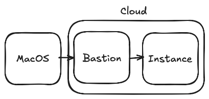

# Summary

Terraform configuration to spin up an AWS compute instances for bastion and private
node.

## Pre-requisites

- An AWS account
- A valid SSH key pair for accessing the instance

## Setup



- Clone repo
- Ensure `variables.tf` is configured with your AWS details
- Export environment variables for AWS credentials:

```bash
export AWS_ACCESS_KEY_ID="<YOUR_AWS_ACCESS_KEY>"
export AWS_SECRET_ACCESS_KEY="<YOUR_AWS_SECRET_KEY>"
```

- Run terraform commands

### Connecting to the instance

Once the instance is up, you can connect to it using SSH:

```bash
ssh -i <PEM key> -o ProxyCommand="ssh -i <PEM key> -W %h:%p ubuntu@<bastion IP/hostname>" ubuntu@<private IP>
```
